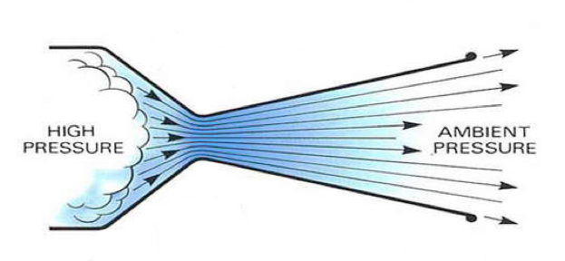

<h1>CFD Analysis of a Super Sonic Nozzle </h1>

<strong>Numerical Simulation of a Converging Diverging Nozzle: Effect of Outlet Area on Mach Number and Acceptable Back Pressures</strong>

<strong>Introduction:</strong>

Converging-diverging nozzles, also called CD nozzles, are a cylinder that is narrow in the middle. They are used to accelerate hot exhaust gases to supersonic velocities, thereby converting as much of the flow&#39;s energy into kinetic energy. They are used in steam turbines, rocket engines, and jet engines. Given a large enough pressure drop from inlet to outlet, in the converging section of the nozzle the flow accelerates to the speed of sound, then during the diverging section the flow continues to accelerate to supersonic speeds.

During supersonic flow, as the back pressure is increased (and thus the pressure drop is decreased) a shock will form in the diverging section of the nozzle, where the flow shocks from supersonic to subsonic speeds. This is incredibly undesirable as you are not maximizing the nozzle geometry in the conversion of flow energy into kinetic energy and can damage the engine. If the back pressure is increased enough, supersonic speeds will not form in any part of the nozzle. An increase in the area of the outlet gives a higher mach number at the exit, but limits the range of back pressures in which the rocket can operate.

Since this flow will have a large Reynolds number, viscous effects will be small, therefore the flow is modeled as inviscid. This is a reasonable assumption, since for the turbulent flow, the viscous effects will stay close to the wall.

The objective of this project is to perform this nozzle investigation using a CFD software package called Fluent. For the range of nozzle outlet areas, we will find the maximum acceptable back pressures. We will also see, for a constant back pressure, how the increase in outlet area increases Mach number at flows near the wall and at the center line of the nozzle.

<a href="max_plomer_cfd_paper.pdf">DOWNLOAD PAPER</a>

<a href="max_plomer_cfd_presentation.pdf">DOWNLOAD PRESENTATION</a>
