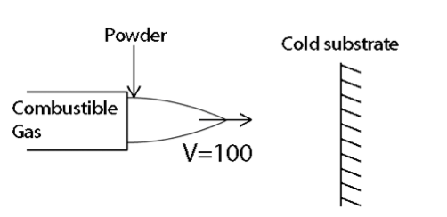

<h1>Plasma Spray Coatings Research for Pratt and Whitney</h1>
<strong>Plasma Spray Coating: Location of Particle When It Has Fully Melted</strong>

<strong>Summary:</strong>

The following is a preliminary research of the Plasma Spray Coating process; we will review basic heat transfer material and then build a simple analytical/numerical estimate of the location of a particle when it has reached melting temperature and then when it has fully melted. There are 3 main problems that are combined into the solution:

(1) Lumped capacitance model is used for low Biot number spheres being heated to melting temperature

(2) Once particle reaches melting temperature this becomes a Stefan Problem where we calculate the particle&#39;s solid fraction using it&#39;s latent heat of melting

(3) Linear and quadratic drag coefficients are used to calculate the location of the particle when melted.

<a href="max_plomer_plasma_spray_research.pdf">VIEW PAPER</a>
