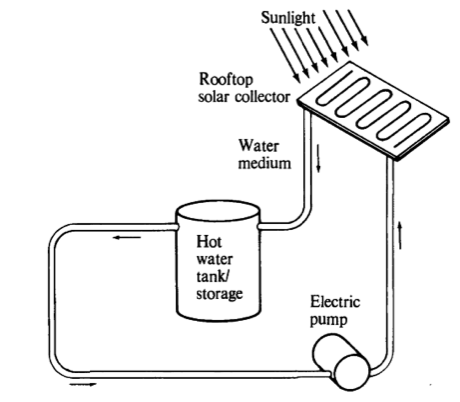

<h1>Effect of Environmental Temperature on Efficiency of Solar Thermal Power Plants </h1>
<strong>Analysis of the effect of environmental temperature on the efficiency of thermal storage of solar thermal power plants.</strong>

<strong>Abstract:</strong>
The application will be to determine the efficiency of solar thermal power plants, by looking at the thermal energy storage. Is there greater efficiency at low or high environmental temperatures? In other words what recovery of the energy can we expect?
We will examine solutions to simple problems that will build an overall analysis. Our focus will be a simple analytical estimate of efficiency, with suggestions on how the model can be further improved upon in future work.

<a href="max_plomer_multiphase_paper.pdf">VIEW PAPER</a>
